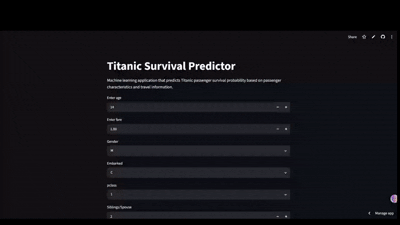
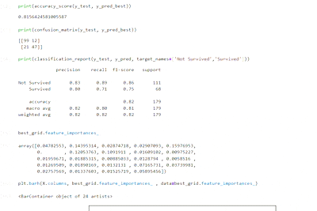

# Titanic Survival Prediction Project

## Project Overview

This project develops a machine learning model to predict whether a passenger aboard the Titanic would survive based on demographic information, ticket details, and travel characteristics. The project covers the complete machine learning workflow, including data preprocessing, feature engineering, model training, evaluation, hyperparameter tuning, model persistence, and deployment through a Streamlit web application.

The final solution uses a Random Forest Classifier and allows users to enter passenger information through an interactive web interface to obtain survival predictions and probability estimates.

---

## Live Project 

https://titanic-survival-app-weenaithdev.streamlit.app/

---

## Dataset

**Source:** Titanic Dataset (Kaggle)

The dataset contains passenger information such as:

* Passenger Class (Pclass)
* Sex
* Age
* Fare
* Number of Siblings/Spouses aboard (SibSp)
* Number of Parents/Children aboard (Parch)
* Port of Embarkation (Embarked)
* Survival Status (Target Variable)

### Target Variable

* **0** → Did Not Survive
* **1** → Survived

---

## Feature Engineering

Several additional features were created to improve predictive performance:

### IsAlone

Identifies whether a passenger traveled alone.

### Age Category

Passengers were grouped into categories:

* Child
* Teen
* Adult
* Senior

### Family Size Category

Passengers were categorized based on family size:

* Alone
* Small Family
* Large Family

### Passenger Type

Combined passenger gender and ticket class:

Examples:

* female1
* female2
* female3
* male1
* male2
* male3

### One-Hot Encoding

Applied to categorical variables including:

* Sex
* Embarked
* Age Category
* Family Size Category
* Passenger Type

---

## Models Used

The following machine learning models were trained and compared:

### Logistic Regression

Used as a baseline classification model.

### Decision Tree Classifier

Evaluated non-linear decision boundaries and feature interactions.

### Random Forest Classifier

Selected as the best-performing model based on evaluation metrics and ROC-AUC score.

### XGBoost Classifier

Used for performance comparison against Random Forest.

---

## Evaluation Metrics

Model performance was evaluated using:

* Accuracy Score
* Precision
* Recall
* F1-Score
* Confusion Matrix
* ROC Curve
* ROC-AUC Score

### Validation Techniques

* Cross Validation
* GridSearchCV Hyperparameter Tuning

---

## Results

### Random Forest Classifier

* Accuracy: ~79%
* ROC-AUC Score: ~0.85

### XGBoost Classifier

* Accuracy: ~73%
* ROC-AUC Score: ~0.82

### Best Model

**Random Forest Classifier** achieved the strongest overall performance and was selected for deployment.

---

## How to Run

### 1. Clone Repository

```bash
git clone <repository-url>
cd titanic_intelligence_dataset
```

### 2. Create Virtual Environment

```bash
python -m venv ml_env
```

### 3. Activate Environment

Windows:

```bash
ml_env\Scripts\activate
```

### 4. Install Dependencies

```bash
pip install -r requirements.txt
```

### 5. Launch Streamlit Application

```bash
streamlit run .\streamlit_app.py --server.port 8502
```

### 6. Open Browser

```text
http://localhost:8502
```

---

## Screenshots

### Application Home Screen

### Prediction Example


### Model Evaluation


---

## Technologies Used

### Programming Language

* Python

### Libraries

* pandas
* numpy
* scikit-learn
* xgboost
* matplotlib
* joblib
* streamlit

### Concepts

* Data Cleaning
* Exploratory Data Analysis (EDA)
* Feature Engineering
* Classification Models
* Cross Validation
* Hyperparameter Tuning
* Model Evaluation
* Machine Learning Deployment
